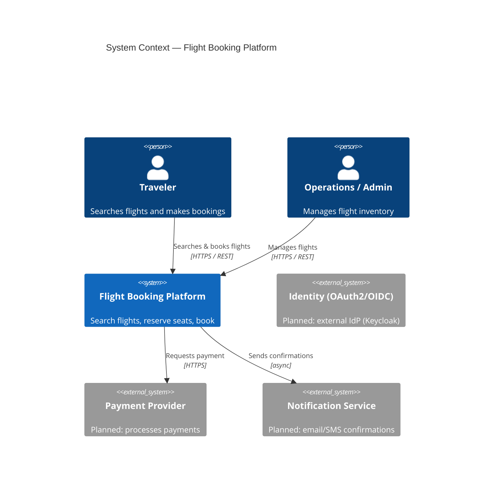
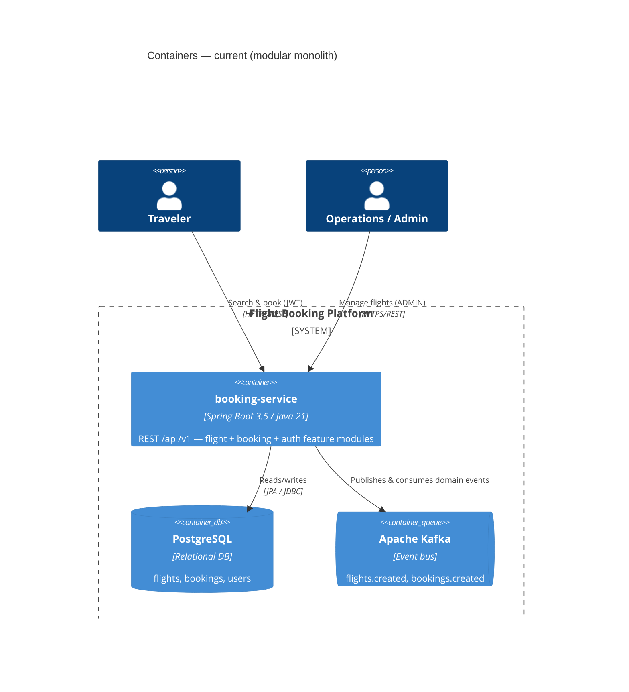
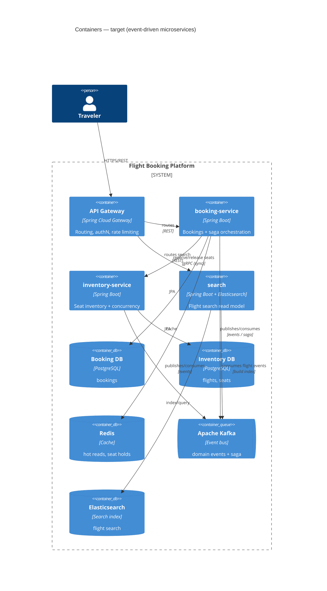
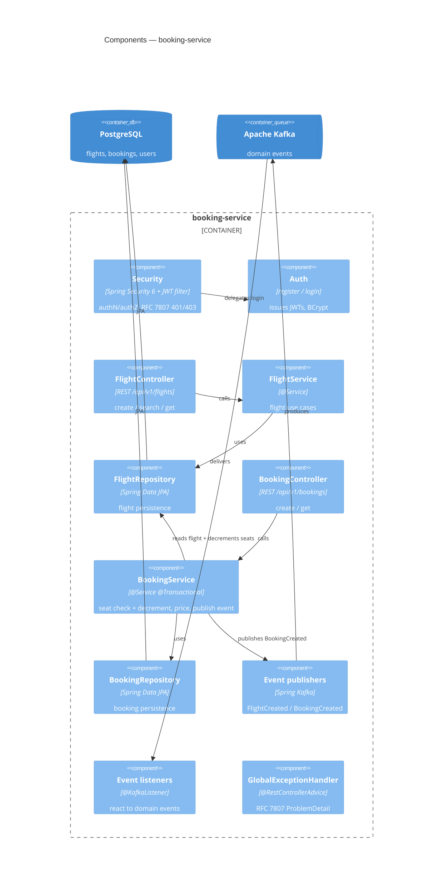

# Architecture

The system is described with the [C4 model](https://c4model.com): **Context → Container → Component**. Diagrams are Mermaid (rendered by GitHub).

The service is built as a **modular monolith** today, with clean bounded contexts that are designed to be extractable into separate services as scaling needs justify it. Both the current shape and the target (microservices) shape are shown below.

---

## Level 1 — System Context

Who uses the system and what it depends on.

Authentication is currently handled in-app with self-issued JWTs; an external identity provider is a planned evolution.

---

## Level 2 — Containers (current)

Everything booking-related runs in a single Spring Boot application backed by PostgreSQL, with Kafka for domain events.

**Why a monolith first:** clean module boundaries are enforced *in-process* (fast, refactorable, one deployment) so the correct bounded contexts can be discovered cheaply before any of them is promoted to a network-boundary service.

---

## Level 2 — Containers (target)

The intended evolution once independent scaling and fault isolation justify the distributed-systems cost.

Key target decisions: **gRPC** for the low-latency synchronous booking→inventory hop; **Kafka** for asynchronous domain events and the booking↔payment↔ticketing **saga**; **database-per-service**; **Elasticsearch** as an event-fed read model.

---

## Level 3 — Components (`booking-service`)

Inside the current application: feature-first packages, each a vertical slice `Controller → Service → Repository → DB`.

**The extraction seam:** `BookingService` calling `FlightRepository` to check and decrement seats is the one cross-feature edge. `Booking` references a flight by **ID** (not a JPA association), keeping the aggregates decoupled — so this in-process call becomes the gRPC call to a future `inventory-service` without a rewrite.

## Cross-cutting conventions

- **Errors:** RFC 7807 Problem Details (`application/problem+json`) for all error responses, including security (401/403).
- **API:** versioned under `/api/v1`; resources returned directly (no envelope); pagination via Spring Data `Page`.
- **Persistence:** Spring Data JPA / Hibernate over PostgreSQL.
- **Events:** JSON-serialized domain events on Kafka topics `flights.created` and `bookings.created`.
