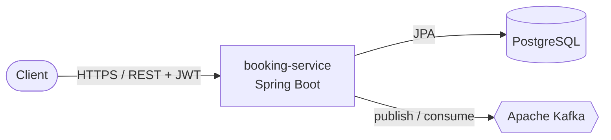

# Flight Booking Platform

[](https://flight-booking-platform-9ls3.onrender.com/swagger-ui.html)
[](https://github.com/duclong565/flight-booking-platform/actions/workflows/ci.yml)


An event-driven flight booking backend built with **Java 21** and **Spring Boot 3.5** — REST APIs for searching flights and making bookings, secured with JWT, with domain events published to **Apache Kafka**. Built as a production-shaped learning project.

> **🌐 Live demo:** **https://flight-booking-platform-9ls3.onrender.com** — try the interactive API at **[`/swagger-ui.html`](https://flight-booking-platform-9ls3.onrender.com/swagger-ui.html)**.
> _Free tier: the first request may take ~30–50s to wake the instance. Demo admin login — `admin` / `admin12345`. (The deployed demo runs without Kafka; events are exercised by the test suite and local `docker compose`.)_
>
> _To try protected endpoints in Swagger UI: call `POST /api/v1/auth/login`, copy the `token`, click **Authorize** (top-right), and paste it._
>
> **Or run the whole stack locally:** `docker compose up --build` → API on `http://localhost:8080`, Swagger UI at `/swagger-ui.html`.

---

## Features

- **REST API** for flights and bookings, documented with **OpenAPI / Swagger UI**
- **JWT authentication** (stateless) with **role-based access control** (`USER` / `ADMIN`)
- **Booking flow** with seat reservation (availability check + decrement) and price calculation
- **Event-driven**: `FlightCreated` and `BookingCreated` domain events published & consumed via **Apache Kafka**
- **RFC 7807 Problem Details** (`application/problem+json`) for every error
- **PostgreSQL** persistence via Spring Data JPA, request validation (incl. a custom cross-field validator)
- **Integration tests** against real Postgres + Kafka using **Testcontainers**, run in **GitHub Actions CI**
- **Fully containerized** — app + Postgres + Kafka come up with a single command

## Tech stack

| Area | Technology |
|---|---|
| Language / Framework | Java 21 (LTS), Spring Boot 3.5 |
| Web / Persistence | Spring Web MVC, Spring Data JPA / Hibernate, PostgreSQL |
| Security | Spring Security 6, JWT (jjwt), BCrypt |
| Messaging | Apache Kafka (Spring for Apache Kafka) |
| API docs | springdoc-openapi (Swagger UI) |
| Testing | JUnit 5, Testcontainers (Postgres + Kafka), Mockito, Awaitility |
| Build / CI | Gradle (multi-module), Docker / Docker Compose, GitHub Actions |

## Architecture

A **modular monolith** (`booking-service`) with feature-first packaging (`flight`, `booking`, `auth`) and a shared `common` library — designed so the `inventory` concern can later be extracted into its own service.



Full **C4 diagrams** (context → container → component) and the current-vs-target evolution are in **[ARCHITECTURE.md](ARCHITECTURE.md)**.

## Getting started

### Prerequisites
- **Docker** (Docker Desktop or Colima) — that's all you need for the one-command run.
- (Optional, for local dev without Docker) JDK 21 + a local PostgreSQL.

### Run the whole stack (recommended)
```bash
docker compose up --build
```
This starts **the app + PostgreSQL + Kafka** (plus a Kafka UI). Once up:
- API base: `http://localhost:8080/api/v1`
- Swagger UI: `http://localhost:8080/swagger-ui.html`
- Health: `http://localhost:8080/actuator/health`
- Kafka UI: `http://localhost:8085`

A default admin user is seeded on startup: **`admin` / `admin12345`** (demo credentials — override via env vars, see [`.env.example`](.env.example)).

### Try the API
```bash
# 1) Log in as the seeded admin to get a JWT
ADMIN=$(curl -s -X POST localhost:8080/api/v1/auth/login \
  -H 'Content-Type: application/json' \
  -d '{"username":"admin","password":"admin12345"}' | jq -r .token)

# 2) Create a flight (ADMIN only)
curl -s -X POST localhost:8080/api/v1/flights \
  -H "Authorization: Bearer $ADMIN" -H 'Content-Type: application/json' \
  -d '{"flightNumber":"VN123","origin":"HAN","destination":"SGN",
       "departureTime":"2026-12-01T08:00:00Z","arrivalTime":"2026-12-01T10:00:00Z",
       "totalSeats":180,"basePrice":1200000.00}'

# 3) Search flights (public, paginated)
curl -s "localhost:8080/api/v1/flights?origin=HAN&destination=SGN"

# 4) Register + log in a regular user
curl -s -X POST localhost:8080/api/v1/auth/register \
  -H 'Content-Type: application/json' -d '{"username":"alice","password":"password123"}'
USER=$(curl -s -X POST localhost:8080/api/v1/auth/login \
  -H 'Content-Type: application/json' \
  -d '{"username":"alice","password":"password123"}' | jq -r .token)

# 5) Book seats (authenticated) — publishes a BookingCreated event to Kafka
curl -s -X POST localhost:8080/api/v1/bookings \
  -H "Authorization: Bearer $USER" -H 'Content-Type: application/json' \
  -d '{"flightId":1,"passengerName":"Alice","passengerEmail":"alice@example.com","seats":2}'

# 6) Fetch the booking by its reference
curl -s localhost:8080/api/v1/bookings/BK-XXXXXXXX
```

### Run locally without Docker
```bash
# requires a local PostgreSQL matching src/main/resources/application.properties, and Kafka
./gradlew :booking-service:bootRun
```

### Run the tests
```bash
./gradlew test          # spins up real Postgres + Kafka via Testcontainers (Docker required)
```

## API overview

| Method | Path | Auth | Description |
|---|---|---|---|
| `POST` | `/api/v1/auth/register` | public | Register a `USER` |
| `POST` | `/api/v1/auth/login` | public | Get a JWT |
| `GET` | `/api/v1/flights` | public | Search flights (filter + pagination) |
| `GET` | `/api/v1/flights/{id}` | public | Get a flight |
| `POST` | `/api/v1/flights` | `ADMIN` | Create a flight |
| `POST` | `/api/v1/bookings` | authenticated | Create a booking |
| `GET` | `/api/v1/bookings/{reference}` | authenticated | Get a booking by reference |

Errors follow **RFC 7807**, e.g. booking more seats than available returns `422` with `application/problem+json`.

## Project structure

```
flight-booking-platform/
├── common/                       # shared library (problem types)
├── booking-service/              # Spring Boot application
│   └── com/deanflights/
│       ├── flight/               # flight feature (entity, repo, service, controller, dto, event, validation)
│       ├── booking/              # booking feature (entity, repo, service, controller, dto, event)
│       ├── auth/                 # users, register/login, JWT DTOs
│       ├── security/             # Spring Security config, JWT filter, problem-based 401/403
│       ├── common/               # exception handling (RFC 7807)
│       └── config/               # Kafka topics, OpenAPI, web, data seeding
├── docker-compose.yml            # app + Postgres + Kafka + Kafka UI
├── Dockerfile                    # multi-stage build → slim JRE 21 image
└── .github/workflows/ci.yml      # build + test on every push / PR
```

## Roadmap

- [x] Flight & booking REST API, validation, RFC 7807 errors
- [x] Kafka domain events (produce + consume)
- [x] JWT auth + role-based access control
- [x] Dockerized stack + Testcontainers tests + CI
- [ ] Redis caching + rate limiting
- [ ] Extract `inventory-service` (Kafka saga + gRPC, seat-concurrency)
- [ ] Elasticsearch flight search
- [ ] Kubernetes + observability (Prometheus / Grafana / OpenTelemetry)

## Notes

- Demo secrets (JWT signing key, admin password) ship as defaults for local use and are overridable via environment variables (see [`.env.example`](.env.example)). They would be supplied as real secrets in any deployed environment.
